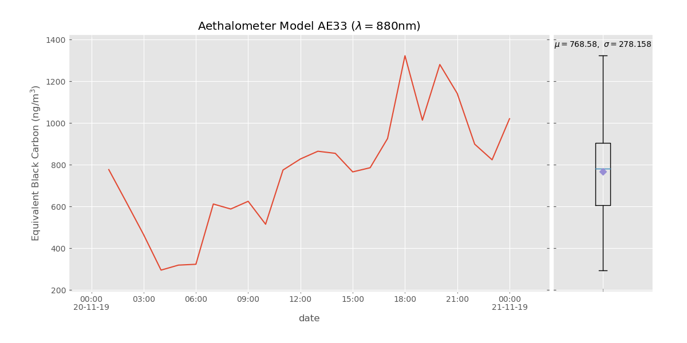
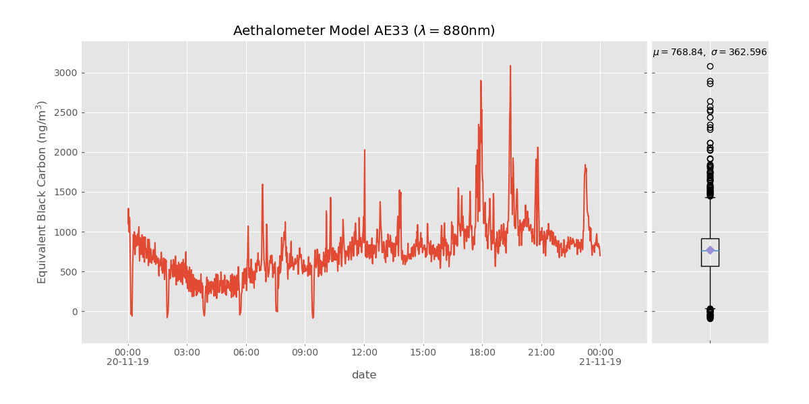

# Aethalometer Visualization Scripts
## Python script visualization and data-averaging of Aethalometer datafiles (AE31 and AE33)

### **Installation**
1. Clone repository:
```bash
$ git clone https://github.com/alejandrokeller/aethalometer
```
2. Travel to cloned folder:
```bash
$ cd aethalometer
```
3. Create a local config.ini file:
```bash
$ cp config config.ini
```
4. Edit the config.ini file by adding the default data path and file extension (e.g. ".dat").
The script searches this path for the latest file if it is used used without a file argument.
The 'FREQ' option defines the default generated averaging interval (i.e. HOURLY, MINUTELY, SECONDLY). SECONDLY outputs intervals of 10 seconds.
The script can also output raw data.
5. Install python requirements:
```bash
$ pip install -r extras/requirements.txt
```

### **Usage**

`aeth.py [-h] [--inifile INI] [--ae33 | --ae31] [--iON | --iOFF]
               [--intervals CSV] [--bckey BCKEY]
               [file [file ...]]`
               
| Argument | Description |
| --- | --- |
|-h, --help     | show help message and exit|
|--inifile INI  | Path to an alternative configuration file|
|--ae33         | Uses file format for AE33 datafiles (default)|
|--ae31         | Uses file format for AE31 datafiles|
|--iON          | Calculates average values for given intervals, and plot average values (default)|
|--iOFF         | Do not calculate intervals; plot all datapoints|
|--intervals CSV| csv file with start and end timestamps columns. First row must be the column names (i.e. "start" and "end"). Uses hourly, minutely, or secondly intervals if this parameteris missing (as defined in config.ini)|
|--bckey BCKEY  | Selects BC1 through BC7 (and BB for AE33). Default: BC6=880nm|

The calculated averaged interval-data for BC1-BC7 and BB are printed by the command. Use `>` to save the data:
```bash
$ aeth.py sample.dat > averaged_data.csv
```

The plots, generated using `matplotlib` are *NOT* automatically saved. They can be saved from the GUI interface.

Hourly interval example:


Minutely interval example:

